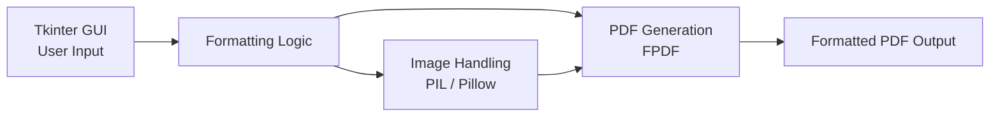

# GUI-Based Letter Formatter and PDF Converter

**A desktop utility that takes structured input and produces a formatted, print-ready PDF document.**

> **Note on this repository:** This is a technical write-up of the tool's design, not the original source tree. It documents the processing pipeline and library choices.

---

## Overview

A small but complete tool: take user input through a native GUI, apply consistent document formatting, and export a polished PDF — the kind of practical utility that's more about clean data flow than algorithmic complexity.

## My Role

Built end-to-end: GUI design, formatting logic, and PDF/image export pipeline.

## Architecture

## Key Design Decisions

- **Tkinter over a web-based UI.** For a single-user desktop utility with no need for remote access, a native GUI avoided the overhead of standing up a local server just to collect form input.
- **FPDF for generation, Pillow for image prep.** FPDF handled text layout and page structure directly, while Pillow pre-processed any embedded images (resizing/format conversion) before they were placed into the PDF — keeping each library scoped to what it does well rather than forcing one tool to do both jobs.

## Key Features

- Native GUI for structured document input
- Automated formatting into a consistent letter layout
- Image processing and embedding via Pillow
- One-click export to a formatted PDF

## Outcome

A functional utility that turns raw input into a polished, shareable document — a small project that's easy to demo end-to-end in an interview setting.
